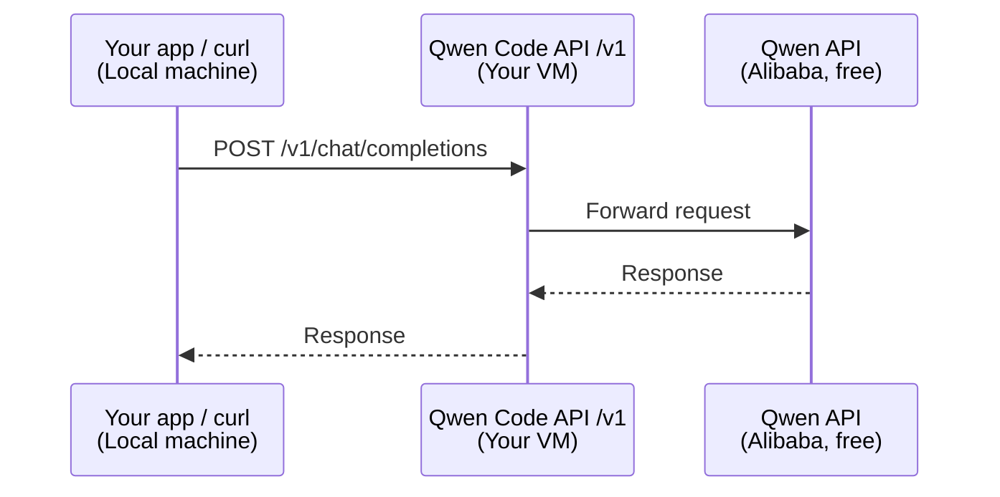

# `Qwen Code` API

<h2>Table of contents</h2>

- [What is `Qwen Code` API](#what-is-qwen-code-api)
- [`qwen-code-api` repository](#qwen-code-api-repository)
- [`Qwen Code` API key](#qwen-code-api-key)
  - [`<qwen-code-api-key>` placeholder](#qwen-code-api-key-placeholder)
- [`Qwen Code` API host port](#qwen-code-api-host-port)
  - [`<qwen-code-api-host-port>` placeholder](#qwen-code-api-host-port-placeholder)
- [`Qwen Code` API base URL](#qwen-code-api-base-url)
  - [`<qwen-code-api-base-url>` placeholder](#qwen-code-api-base-url-placeholder)
- [`Qwen Code` API model](#qwen-code-api-model)
  - [`<qwen-code-api-model>`](#qwen-code-api-model-1)
- [Check that the `Qwen Code` API is accessible](#check-that-the-qwen-code-api-is-accessible)

## What is `Qwen Code` API



The `Qwen Code` API is an [OpenAI-compatible API](./llm.md#openai-compatible-api) that uses the [`Qwen Code` credentials file](./qwen-code.md#qwen-code-credentials-file) to provide access to the [`Qwen` API](./qwen-code.md#qwen-api).

The `Qwen Code` API is deployed using the [`qwen-code-api` repository](#qwen-code-api-repository).

## `qwen-code-api` repository

<https://github.com/inno-se-toolkit/qwen-code-api>

## `Qwen Code` API key

The [API key](./web-api.md#api-key) that is used to authorize requests to the [`Qwen Code` API](#what-is-qwen-code-api).

The key should follow the [API key format](./web-api.md#api-key-format).

You store the key in [`QWEN_CODE_API_KEY`](./qwen-code-api-dotenv-secret.md#qwen_code_api_key) in [`qwen-code-api/.env.secret`](./qwen-code-api-dotenv-secret.md#qwen_code_api_key).

### `<qwen-code-api-key>` placeholder

The [`Qwen Code` API key](#qwen-code-api-key) (without `<` and `>`).

## `Qwen Code` API host port

The [port](./computer-networks.md#port) at which the [`Qwen Code` API](./qwen-code-api.md#what-is-qwen-code-api) is available on the [host](./computer-networks.md#host) where it is deployed.

### `<qwen-code-api-host-port>` placeholder

The [`Qwen Code` API host port](#qwen-code-api-host-port) (without `<` and  `>`).

## `Qwen Code` API base URL

- (REMOTE) When running the request on the VM (does not depend on whether the [LMS API is deployed on the VM](./lms-api-deployment.md#deploy-the-lms-api-on-the-vm)):
  
  `http://localhost:<qwen-code-api-host-port>/v1`

Replace the placeholders:

- [`<qwen-code-api-host-port>`](#qwen-code-api-host-port-placeholder)

See:

- [`localhost`](./computer-networks.md#localhost)

### `<qwen-code-api-base-url>` placeholder

[`Qwen Code` API base URL](#qwen-code-api-base-url) (without `<` and `>`).

## `Qwen Code` API model

The identifier of a `Qwen` model available in `Qwen Code` API.

[View available models](./qwen-code.md#view-available-models).

Example: `coder-model`.

### `<qwen-code-api-model>`

[`Qwen Code` API model](#qwen-code-api-model) (without `<` and `>`).

## Check that the `Qwen Code` API is accessible

> [!NOTE]
>
> These instructions cover the cases when you run the request:
>
> - on your VM (REMOTE)
> - on your local machine (LOCAL)

1. [Enter the lab repository directory](./lab.md#enter-the-lab-repository-directory).

2. To send an [`HTTP` request](./http.md#http-request) to the [`Qwen Code` API](#what-is-qwen-code-api),

   [run in the `VS Code Terminal`](./vs-code.md#run-a-command-in-the-vs-code-terminal):

   ```terminal
   uv run poe query-qwen-code-api \
     --base-url <qwen-code-api-base-url> \
     --api-key <qwen-code-api-key> \
     --model <qwen-model> \
     "What is 2+2?"
   ```

   Replace the placeholders:

   - [`<qwen-code-api-base-url>`](#qwen-code-api-base-url-placeholder) (depends on the case (REMOTE or LOCAL))
   - [`<qwen-code-api-key>`](#qwen-code-api-key)
   - [`<qwen-code-api-model>`](#qwen-code-api-model)

3. When you run it, the output should be similar to this:

   ```terminal
   {
      "created": 1773942368,
      "usage": {
         "completion_tokens": 165,
         "prompt_tokens": 22,
         "completion_tokens_details": {
            "text_tokens": 165,
            "reasoning_tokens": 152
         },
         "prompt_tokens_details": {
            "cache_creation": {
               "ephemeral_5m_input_tokens": 0
            },
            "text_tokens": 22,
            "cache_creation_input_tokens": 0,
            "cache_type": "ephemeral",
            "cached_tokens": 0
         },
         "total_tokens": 187
      },
      "model": "qwen3.5-plus",
      "id": "chatcmpl-c80dbef9-d5cd-4ee1-8a1e-bc462e19b20e",
      "choices": [
         {
            "finish_reason": "stop",
            "index": 0,
            "message": {
               "role": "assistant",
               "content": "2 + 2 equals **4**.",
               "reasoning_content": "... **Final Output:** \"4\" or \"2 + 2 equals 4.\" ..."
            },
            "logprobs": null
         }
      ],
      "system_fingerprint": null,
      "object": "chat.completion"
   }
   ```
